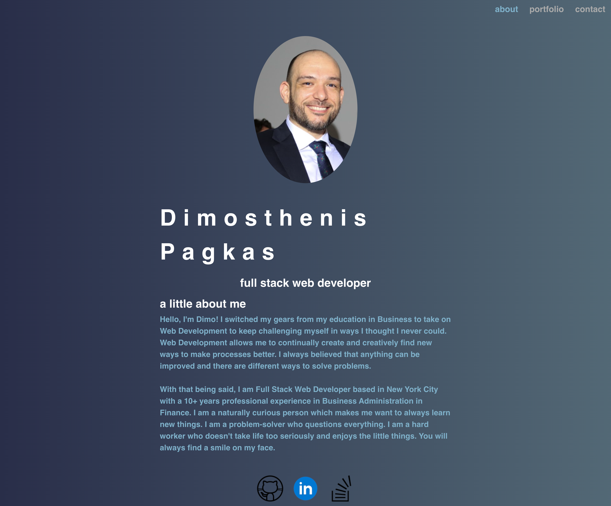
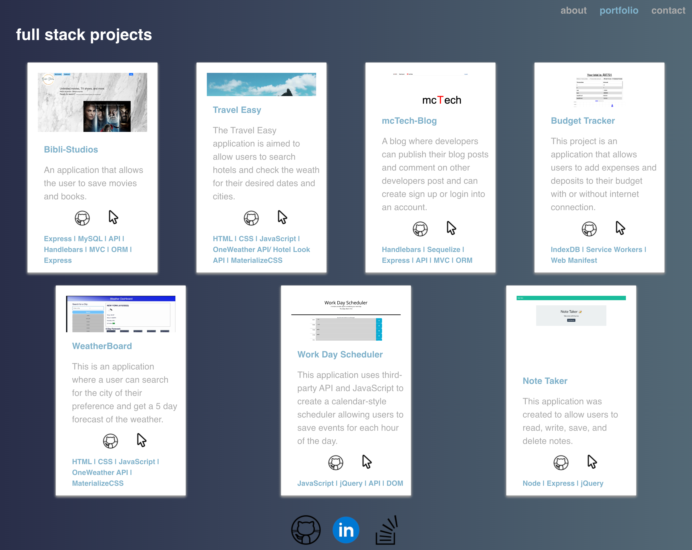
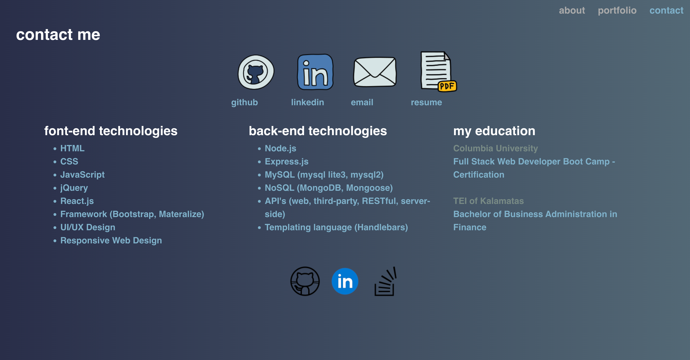

# Portofolio-React

## Description

-   This project is a single-page application using React.js to dynamically render content to create a portfolio that includes "About me", "Contact me", "Resume", and "Portfolio" pages. Take a look at my work through my portfolio page and get to know me a little bit! Download my resume to view my work experience and where to find me.

## Link to the app

Link to the github app: [portofolio-react](https://github.com/djpdim/portofolio-react)

Link to the github page: [portofolio-react](https://djpdim.github.io/portofolio-react/)

## Tample of Content

-   [Installation](#installation)
-   [Usage](#usage)
-   [Credits](#credits)
-   [License](#license)
-   [Features](#features)
-   [Questions](#questions)

## Installation

-   The user should clone the repository from GitHub and install dependencies. To run React, run npm start.

## Usage

-   This application will allow users view an about me page, send information through a contact form, view my projects, and view my resume. 
    Please view deployed application on [Git Hub Pages](https://djpdim.github.io/portofolio-react/#about) 

## Credits

-   Tutors and TA's

## License

-   MIT

## Badges

Check out the badges hosted by [shields.io](https://shields.io/).

## Features

## Questions

For any questions, please contact me to the informations below:

-   GitHub: [djpdim](https://github.com/djpdim)
-   Email: [dimospagkas@yahoo.gr](mailto:dimospagkas@yahoo.gr)

[Top](#description)
